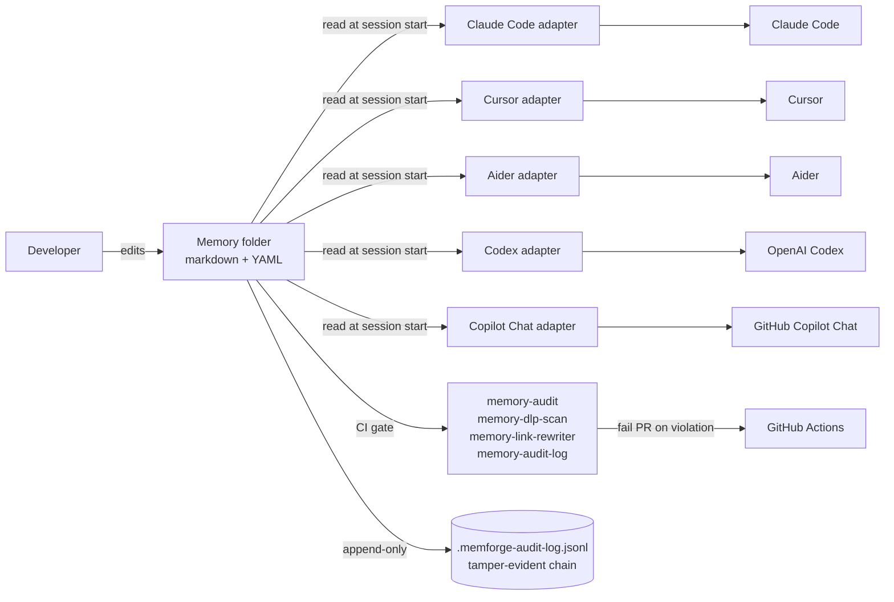

# MemForge

**Typed, git-native, dynamic memory for coding agents.** A markdown folder + a small spec + reference tooling. Works across Claude Code, Cursor, Aider, Codex, and GitHub Copilot Chat through thin adapters. As of v0.5, supports multi-operator teams with cryptographic attribution; as of v0.5.2, the reference CLI ships under a single `memforge` dispatcher with cross-platform support (macOS, Linux, native Windows).

[](https://doi.org/10.5281/zenodo.20114965) **Current release: v0.5.6** (most-recent Zenodo deposit: v0.5.3) ([PyPI](https://pypi.org/project/ildan-memforge/) | [CHANGELOG](./CHANGELOG.md) | [spec](./spec/SPEC.md) | [examples](./examples/))

> **Status: pre-1.0; external PRs paused.** Issues and Discussions are open. External pull requests are paused until the Contributor License Agreement infrastructure lands. See [CONTRIBUTING.md](./CONTRIBUTING.md). Security reports go through the private channel in [SECURITY.md](./SECURITY.md).

## Quickstart (v0.5+, ~3 minutes)

```bash
pip install ildan-memforge
memforge --version                  # memforge 0.5.6
memforge init-operator --name "Your Name" --gen-key
memforge recovery-init
memforge recovery-backup-confirm --i-have-backed-up-the-secret
cd /path/to/memory-root
memforge init-store
memforge messaging-doctor           # verify v0.5 posture: ALL CHECKS PASSED
```

Full quickstart at [`docs/quickstart.md`](./docs/quickstart.md) (includes a section on commit hygiene + the signed `memforge:` commit-prefix grammar that audit / resolve / revoke parse). Multi-operator team bootstrap at [`docs/team-bootstrap.md`](./docs/team-bootstrap.md) (includes "Pick your transport: git-only or WebSocket?" decision-framing for teams sizing the v0.5 messaging adapter).

## Cite this work

If you use MemForge in research or publications, please cite:

> Hiltz, Mike. *MemForge: Portable, agent-neutral persistent memory format for AI coding agents (v0.5.3)*. Zenodo, 2026. DOI: [10.5281/zenodo.20114965](https://doi.org/10.5281/zenodo.20114965)

## The gap MemForge fills

Coding agents have static instruction surfaces (AGENTS.md, `.cursorrules`, `CONVENTIONS.md`, `.github/copilot-instructions.md`, Claude Code's auto-memory) for things you want the agent to read at the start of every session. They handle the "always-true" half well.

What they don't handle: the **changing** half. The fact that you decided to use `bun` not `npm` last Tuesday. The reason you rejected the obvious database schema. The post-incident rule about not mocking the staging API. The seven things you've told four different agents the same way and are tired of repeating.

That state belongs in *memory*: typed entries that the agent can read, write, audit, and version-control alongside the code. MemForge is the format for that memory and a small set of tools that keep it healthy.

## What you get

- **A folder of markdown files** with YAML frontmatter. Hand-editable, diffable, code-reviewable.
- **Four memory types:** `user` (facts about the developer), `feedback` (rules they have given), `project` (state about ongoing work), `reference` (pointers to external systems).
- **A `MEMORY.md` index** any agent loads at session start.
- **Rollup subfolders** for topic clusters of five or more memories, so the index stays scannable.
- **Audit + integrity tooling** that runs in CI: schema checks, link integrity, DLP scan, tamper-evident audit log.
- **Adapters** for Claude Code, Cursor, Aider, OpenAI Codex, and GitHub Copilot Chat (VS Code).

## 60-second install

```bash
pip install ildan-memforge
```

The PyPI distribution is published under `ildan-memforge` because the
shorter `memforge` name is held by an unrelated project. The Python
import path is still `memforge`, and the 17 CLI commands install with
the same names (`memory-audit`, `memory-watch`, `memory-dlp-scan`,
`memforge-resolve`, etc.).
You can also install straight from source:

```bash
pip install git+https://github.com/ildan-ai/memforge.git
```

### macOS / Homebrew Python (PEP 668)

On macOS with Homebrew Python, `pip install` against the system
interpreter is blocked by [PEP 668](https://peps.python.org/pep-0668/)
(`error: externally-managed-environment`). Use one of:

```bash
# Option A: pipx (recommended; isolates the install)
brew install pipx
pipx install ildan-memforge

# Option B: dedicated venv
python3 -m venv ~/.local/share/memforge/.venv
~/.local/share/memforge/.venv/bin/pip install ildan-memforge
# then symlink the binaries into a directory on $PATH

# Option C: --user --break-system-packages (last resort; pollutes brew Python)
python3 -m pip install --user --break-system-packages ildan-memforge
```

The same caveat applies on most Linux distributions that mark their
system Python `EXTERNALLY-MANAGED` (Debian 12+, Ubuntu 23.04+, Fedora
38+, etc.).

Pick a folder for your memory. The defaults the tooling assumes:

```
~/.claude/global-memory/                          # cross-project rules
~/.claude/projects/<USER>-claude-projects/memory/ # per-cwd state
```

Other layouts work too; the tooling takes a `--path` argument everywhere.

## A memory file, end-to-end

```markdown
---
name: Use bun, not npm
description: Bun is the package manager for this monorepo
type: feedback
tags: [topic:tooling, topic:javascript]
status: active
created: 2026-04-12
---

When installing or running scripts in this repo, use `bun` and `bunx`. Lockfile is `bun.lockb`.

**Why:** the workspace setup at `apps/web/package.json` relies on bun's workspace resolver; npm pulls a slightly different dependency tree and the build fails downstream.

**How to apply:** any time you reach for `npm install`, `npx`, or a `package-lock.json`, stop and use bun instead. If a script in the README still says `npm run`, treat that as a docs bug, not a directive.
```

That file is the unit. Every tool, every adapter, every check operates on files of exactly this shape.

## When MemForge is the right tool

- You move between coding agents and want them to share the same notes.
- You want memory entries reviewable in pull requests, like code.
- You want the operator to *see* what the agent has written about them and edit it freely.
- You want CI gates on memory hygiene (broken links, secret leakage, schema drift).

## When it is not

- **Not a vector database.** No embeddings, no similarity search at runtime. Use `mem0` or `letta` if that is the shape you need.
- **Not a secrets store.** The DLP scanner refuses files that look like they leak credentials, but the format is human-readable plain text. Keep secrets in a vault.
- **Not a runtime memory layer.** MemForge is the *file format and the discipline*, not a service. Adapters load files into agent context at session start; nothing runs continuously.
- **Not a replacement for AGENTS.md.** AGENTS.md is the README for agents (static, repo-level, project setup). MemForge is the working notebook (dynamic, evolving, often per-developer). They coexist.

## How it compares

| | **MemForge** | mem0 | letta | `.cursorrules` / `AGENTS.md` |
| --- | --- | --- | --- | --- |
| Storage | Markdown files in git | Hosted vector store | Hosted agent state | Single text file |
| Typed entries | Yes (4 types + status) | No | Partial | No |
| Cross-agent | Yes (adapters) | Per-SDK | Per-SDK | Per-agent |
| Reviewable in PRs | Yes (diff = the file) | No (opaque store) | No | Yes |
| Runtime cost | Zero (load at session start) | Per-query embedding cost | Per-query | Zero |
| Best for | Long-lived rules + decisions | Conversational recall | Stateful agent loops | Project-level setup |

The honest summary: if your agent is a long-running service that needs to remember a thousand things from yesterday's chat, you want a vector store. If your agent is a coding session that needs to remember the rules and decisions a human cares about across sessions, you want MemForge.

## Architecture



Adapters are thin: they translate "load this folder at session start" into the agent's native rules surface. Adding an agent means writing a new adapter, not changing the format.

## Key tools

Run `--help` on any of them.

### v0.5+ operator + identity surface (under the `memforge` dispatcher)

| Subcommand | What it does |
| --- | --- |
| `memforge init-operator` | Generate operator-UUID + register a GPG signing key as the operator identity. |
| `memforge init-store` | Bootstrap `.memforge/` in a memory-root + create a signed operator-registry. |
| `memforge operator-registry {add\|verify\|remove\|fresh-start}` | Manage the operator-registry (add a peer operator; verify the signature; etc.). |
| `memforge rotate-key` | Generate a new long-lived key, cross-sign with the old one, lands the registry update with a 24-hour cool-down. |
| `memforge revoke <key_id> --reason ...` | Build a signed `memforge: revoke <key_id>` commit body. |
| `memforge revocation-snapshot` | Emit a signed snapshot of the current revocation set. |
| `memforge memories-by-key <key_id>` | List memories signed under a given key (forensic + bulk-revoke prep). |
| `memforge revoke-memories <key_id> --bulk` | Mark memories signed by a revoked key as `status: superseded`. |
| `memforge upgrade-v04-memories --apply` | Add v0.5 `identity` + `signature` frontmatter to v0.4 memories in-place. |
| `memforge revoke-cache-refresh` | Refresh the remote-fetch revocation cache (sparse-checkout / shallow-clone mode). |
| `memforge messaging-doctor` | Run the v0.5.1 fail-closed checklist + report posture (OK / WARN / FAIL). |
| `memforge recovery-init` | Generate `~/.memforge/recovery-secret.bin` + anchor SHA256 in the signed operator-registry. |
| `memforge recovery-backup-confirm` | Acknowledge offline backup of the recovery-secret; unlocks v0.5+ writes. |
| `memforge attest-agent` | Issue a signed agent-session attestation (nonce + expires_at + capability_scope). |

### v0.3 / v0.4 memory-format surface (per-tool console scripts)

| Tool | What it does |
| --- | --- |
| `memory-audit` | Schema + integrity check. Pass `--strict` in CI. |
| `memory-audit-deep` | Recursive audit: UID uniqueness, taxonomy membership, supersedes resolution, link integrity. |
| `memory-index-gen` | Build `MEMORY.md` from frontmatter as a CI artifact. RBAC-aware filtering for shared folders. |
| `memory-cluster-suggest` | Suggest rollup subfolders when a topic accumulates five or more memories. |
| `memory-dlp-scan` | Pre-commit scanner for secrets, credentials, and PII in memory bodies. |
| `memory-link-rewriter` | UID-based cross-folder link integrity (`check`, `rename`, `rename-batch`, `upgrade`). |
| `memory-audit-log` | Append-only tamper-evident hash chain. JSONL on disk, exports CEF for SIEM. |
| `memory-dedup` | LLM-backed near-duplicate detection. Local-only by default; reports candidates, never writes. |
| `memory-rollup` | Bulk-move primitive: create / undo / list. Maintains an undo ledger. |
| `memory-query` | Filter memories by topic, type, tag, status, owner, date range, or text. |
| `memory-watch` | Filesystem watcher (Linux + macOS via watchdog). |
| `memory-promote` | Move a memory between folders with index fixup. |

`memforge <subcommand> --help` and `tools/README.md` have the long-form references.

## Spec

Format invariants are in [`spec/SPEC.md`](./spec/SPEC.md). Topic taxonomy is in [`spec/taxonomy.yaml`](./spec/taxonomy.yaml). The current package version is in `pyproject.toml`; the on-disk format version is in [`spec/VERSION`](./spec/VERSION). They track separately on purpose: a tooling release does not always shift the format, and a format bump is a deliberate event.

## Status

| Version | Date | Headline |
| --- | --- | --- |
| v0.1.0 | 2026-04-19 | First spec release. |
| v0.2.0 | (unreleased) | Sensitivity classification (4 levels) + consumer obligations. |
| v0.3.0 | 2026-05-07 | Schema expansion (uid, tier, tags, owner, last_reviewed, status), rollup-with-subfolder formalization, access labels, controlled topic taxonomy, full Phase 1 tooling, audit log, DLP scan. |
| v0.4.0 | 2026-05-08 | Required-field expansion: `uid`, `tier`, `tags`, `owner`, `status`, `created` required (was optional in v0.3.x). v0.3.x files load in degraded mode. Multi-agent concurrency: five new frontmatter keys, snooze record, config file, resolve operation, canonical competing-claim block, layered Tier 1 + Tier 2 audit rule set, status enumeration BLOCKER, secure-mode adapter conformance. Sensitivity enforcement: default-on export-tier gate (`memory-audit --export-tier`), DLP label/content cross-check, conformance fixture set; hard floor protects `privileged` tier from config-disable. Closes the v0.3.x multi-user concurrency deferral. |
| v0.5.0 | 2026-05-10 | Multi-identity + cryptographic attribution + WebSocket messaging adapter. Operator + agent identity as first-class peers with GPG signing. Sender-uid + sender-sequence + signed checkpoints. Signing-time-aware revocation verification + clock-skew guard. 24-hour cool-down on key rotation. Recovery-secret filesystem mode + SHA256-anchored content integrity. |
| v0.5.1 | 2026-05-10 | Reference CLI ships (14 subcommands under `memforge` dispatcher). Closes v0.5.0 agent-session-attestation content-scope MAJOR with normative `nonce` + `expires_at` + `capability_scope`. Cross-cutting fail-closed posture (29-item operator reference). Privacy considerations (7 boundary statements). |
| v0.5.2 | 2026-05-10 | Closes 2 BLOCKERs + 1 MAJOR from retrospective code panel. Canonical-form Unicode NFC normalization MUST on signed envelopes (closes repudiation via normalization drift). Atomic O_CREAT\|O_EXCL + fsync + os.replace on `write_secure_yaml` + `write_secure_bytes` (closes TOCTOU on file create). Seen-nonce set bounding MAY -> SHOULD with explicit GC contract (closes unbounded-set DoS). Cross-platform secure-file abstraction (`src/memforge/_security.py`): POSIX mode bits on macOS/Linux + NTFS ACLs (via `icacls`) on native Windows. CI matrix extends to Ubuntu + macOS + Windows. |

The reference implementation is running in production. External adoption is welcome once the CLA flow is live.

## License

Apache-2.0. See [`LICENSE`](./LICENSE).

The "MemForge" name and logo are subject to pending trademark filings; the Apache-2.0 grant does not cover the marks. A trademark policy will land alongside the v0.3.x CLA release.

## Contributing

External pull requests are paused. Issues and Discussions are open. See [CONTRIBUTING.md](./CONTRIBUTING.md) for the current model and the post-CLA contributor flow.
